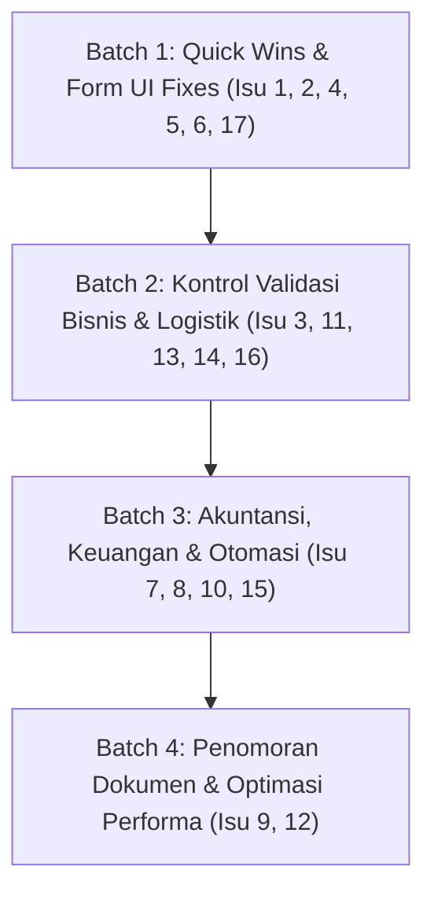

# DOKUMEN AUDIT, REVIEW TEKNIS & RENCANA PERBAIKAN: 17 BUG SEDANG UAT DUTA TUNGGAL ERP

**Tanggal Audit:** 18 September 2026  
**Auditor:** Antigravity AI Engineering Team  
**Kategori:** Bug Sedang (Medium Priority Operational & UI/UX Issues)  
**Status Audit:** Selesai (Analisis Kode, Skema Database & Solusi Teknis)  
**Dokumen Referensi:** Hasil User Acceptance Testing (UAT) Duta Tunggal ERP — 17 Temuan Masalah Operasional  

---

## DAFTAR ISI
1. [Ringkasan Eksekutif](#1-ringkasan-eksekutif)
2. [Matriks Temuan 17 Bug Sedang](#2-matriks-temuan-17-bug-sedang)
3. [Audit Mendalam & Analisis Teknis Per Isu](#3-audit-mendalam--analisis-teknis-per-isu)
   - [Isu 1: Subtotal Tidak Dihitung Ulang Saat Qty Diubah (Modal Approval OR & Buat PO)](#isu-1-subtotal-tidak-dihitung-ulang-saat-qty-diubah)
   - [Isu 2: Status Item OR Tidak Langsung Berubah Setelah Approve](#isu-2-status-item-or-tidak-langsung-berubah-setelah-approve)
   - [Isu 3: Ringkasan OR Salah Hitung (Item Ditolak Masih Dihitung Sisa)](#isu-3-ringkasan-or-salah-hitung)
   - [Isu 4: Tombol Reject OR Hilang Saat Status Menunggu Persetujuan](#isu-4-tombol-reject-or-hilang-saat-status-menunggu-persetujuan)
   - [Isu 5: Tampilan PO Tidak Rapi / Salah (Placeholder TOP & Kurs IDR 0,00)](#isu-5-tampilan-po-tidak-rapi--salah)
   - [Isu 6: Nama Produk di Invoice Pembelian Tampil ID Angka (Contoh: 8582)](#isu-6-nama-produk-di-invoice-pembelian-tampil-id-angka)
   - [Isu 7: Halaman Utang Usaha (Account Payable) Menampilkan Total Rp 0,00 & Tanggal Mentah](#isu-7-halaman-utang-usaha-menampilkan-total-rp-000--tanggal-mentah)
   - [Isu 8: Status Jatuh Tempo Invoice Tidak Berubah Otomatis](#isu-8-status-jatuh-tempo-invoice-tidak-berubah-otomatis)
   - [Isu 9: Penomoran Dokumen Ganda & Format Tidak Seragam (Prefix PR-, Random Suffix)](#isu-9-penomoran-dokumen-ganda--format-tidak-seragam)
   - [Isu 10: Form & Jurnal Pembayaran Vendor Kurang Lengkap](#isu-10-form--jurnal-pembayaran-vendor-kurang-lengkap)
   - [Isu 11: Pemilihan Sales Order di Delivery Order Tidak Dibatasi (SO Selesai Masih Muncul)](#isu-11-pemilihan-sales-order-di-delivery-order-tidak-dibatasi)
   - [Isu 12: Performa Lambat & Tombol Tanpa Status Loading](#isu-12-performa-lambat--tombol-tanpa-status-loading)
   - [Isu 13: Sales Order Tanpa Peringatan & Validasi Stok Kurang](#isu-13-sales-order-tanpa-peringatan--validasi-stok-kurang)
   - [Isu 14: Harga & Qty di Invoice Penjualan Masih Bisa Diedit Manual](#isu-14-harga--qty-di-invoice-penjualan-masih-bisa-diedit-manual)
   - [Isu 15: Akun Persediaan Salah Klasifikasi (Barang Dagang Masuk Bahan Baku)](#isu-15-akun-persediaan-salah-klasifikasi)
   - [Isu 16: Kode Customer Menampilkan / Menggunakan NIK Pribadi](#isu-16-kode-customer-menampilkan--menggunakan-nik-pribadi)
   - [Isu 17: Master Data Ganda, Duplikasi Suffix, dan Salah Ketik (Typo)](#isu-17-master-data-ganda-duplikasi-suffix-dan-salah-ketik)
4. [Pengelompokan Paket Pengerjaan (Implementation Roadmap)](#4-pengelompokan-paket-pengerjaan-implementation-roadmap)
5. [Rencana Verifikasi & Standar Pengujian](#5-rencana-verifikasi--standar-pengujian)

---

## 1. Ringkasan Eksekutif

Setelah menyelesaikan Fase 1, 2, dan 3 (9 isu kritis finansial & alur logistik utama), pengujian pengguna (UAT) lanjutan mengidentifikasi **17 isu kategori sedang (Medium Bugs)**. Isu-isu ini tidak menghentikan database secara fatal, namun menimbulkan risiko operasional yang nyata:
1. **Risiko Keputusan Manajemen:** Approver melihat subtotal dan sisa kuantitas yang keliru pada Order Request, atau pimpinan membaca posisi hutang dagang bernilai `Rp 0,00` padahal kewajiban riil mencapai puluhan juta rupiah.
2. **Kerapian & Kepatuhan Dokumen Eksternal:** Dokumen cetak PO ke supplier menampilkan teks placeholder (*Credit ... Days*) dan kurs IDR `0,00`, invoice pembelian menampilkan ID barang (`8582`), dan nomor dokumen bertabrakan (prefix `PR-` dipakai bersama oleh Purchase Receipt dan Payment Request).
3. **Celah Kebocoran Finansial & Stok:** Harga jual pada Invoice Penjualan masih dapat diedit sepihak tanpa mengacu ke SO; SO berstatus *Completed* masih dapat diterbitkan Delivery Order baru; dan SO dapat disetujui tanpa peringatan stok minus.
4. **Klasifikasi Akuntansi:** Seluruh barang dagangan terpetakan ke akun COA `1140.01` ("Persediaan Bahan Baku - Gudang Utama") karena konfigurasi default sistem belum diarahkan ke `1140.10` ("Persediaan Barang Dagangan").

Audit teknis mendalam terhadap kode sumber dan basis data telah membuktikan seluruh akar masalah ke-17 bug tersebut.

---

## 2. Matriks Temuan 17 Bug Sedang

| No | Modul | Ringkasan Masalah | Akar Masalah Teknis | Prioritas |
|:--:|:---|:---|:---|:---:|
| **1** | Pengadaan (OR & PO) | Qty diubah di modal approval OR / Buat PO, subtotal tidak berubah | `TextInput::make('quantity')` di repeater tidak memiliki hook `afterStateUpdated` | **High** |
| **2** | Pengadaan (OR) | Status item OR masih "Draft" setelah diapprove sampai refresh | Halaman `ViewOrderRequest` tidak memicu `$this->fillForm()` setelah action sukses | **Medium** |
| **3** | Pengadaan (OR) | Item ditolak masih dihitung sebagai sisa belum diterima | `OrderRequestQuantityLock` dan `syncFulfillmentStatus` menyertakan item `rejected` | **High** |
| **4** | Pengadaan (OR) | Tombol Reject OR hilang saat status `request_approve` | Kondisi `visible` pada action reject salah di-hardcode ke `$record->status == 'draft'` | **High** |
| **5** | Pembelian (PO) | TOP tertulis "Credit ... Days", kurs IDR tertulis 0,00 | Label opsi array di-hardcode teks placeholder; kurs IDR tidak memiliki default 1 | **Medium** |
| **6** | Hutang (PINV) | Nama produk tampil ID angka (`8582`) | `Select::make('product_id')` di-limit 50 item dan tidak punya `getOptionLabelUsing` | **High** |
| **7** | Hutang (AP) | Judul AP "Rp 0,00", tanggal tampil mentah `00:00:00` | `getTitle()` menimpa query secara tidak aman; `formatStateUsing` membypass formatter tanggal | **High** |
| **8** | Invoice Global | Status jatuh tempo tidak berubah otomatis ke "Terlambat" | `Kernel.php` tidak memiliki schedule command harian untuk evaluasi `due_date` | **Medium** |
| **9** | Penomoran Dokumen | Prefix `PR-` dipakai dobel (Receipt & Payment Request); nomor acak | Helper menggunakan `rand(0, 9999)` alih-alih sequence berurutan; prefix tidak spesifik | **High** |
| **10** | Kas/Bank (Vendor Pay) | Tombol Buat Pembayaran tidak prefill; jurnal referensi `PAY-1` | `CreateVendorPayment` tidak membaca query string URL; template jurnal hardcode ID | **High** |
| **11** | Penjualan (DO) | SO selesai masih bisa dipilih; DO gabung beda customer | Options memfilter `status IN ('approved', 'confirmed', 'completed')` tanpa validasi customer | **High** |
| **12** | Sistem & UI | Halaman DO lambat; tombol approve tidak ada indikator loading | Query SO memuat relasi berat tanpa eager loading; tombol tidak `disableOnSubmit()` | **Medium** |
| **13** | Penjualan (SO) | SO qty > stok bisa disimpan & diapprove tanpa peringatan | Form SO hanya mencocokkan total alokasi vs qty item, tidak mengecek `free_qty` stok gudang | **High** |
| **14** | Piutang (SINV) | Form invoice penjualan membolehkan ubah qty & harga dari DO | Repeater `invoiceItem` pada Sales Invoice tidak di-`disabled()` / `readOnly()` | **High** |
| **15** | Akuntansi / COA | Barang dagang dicatat ke "Persediaan Bahan Baku" | `config/coa.php` default `inventory` disetel ke `1140.01` (Bahan Baku), bukan `1140.10` | **High** |
| **16** | Master Customer | NIK pribadi tampil di dropdown kode customer | Form customer mengizinkan input manual NIK ke kolom `code`; data tidak disamarkan | **Medium** |
| **17** | Master Data | Supplier dobel (AER vs CAB-AER), typo "Develiry", "EKLUSIF" | Migrasi legacy menduplikasi data cabang; typo hardcoded di resource label & helper | **Medium** |

---

## 3. Audit Mendalam & Analisis Teknis Per Isu

---

### Isu 1: Subtotal Tidak Dihitung Ulang Saat Qty Diubah
- **Gejala UAT:** Di jendela modal Approval OR dan Buat PO, ketika qty diubah dari 50 ke 30, kolom subtotal tetap tertulis Rp 199.800 (seharusnya Rp 119.880).
- **Lokasi Berkas:**
  - `app/Filament/Resources/OrderRequestResource.php` (baris 940–959)
  - `app/Filament/Resources/OrderRequestResource/Pages/ViewOrderRequest.php`
- **Akar Masalah Teknis:**
  Pada method `buildPurchaseOrderSelectedItemsRepeater()`, komponen input `quantity`:
  ```php
  TextInput::make('quantity')
      ->label('Qty')
      ->numeric()
      ->minValue(0)
      ->reactive()
      ->live()
  ```
  Komponen ini memiliki method `live()`, **tetapi tidak memiliki hook `->afterStateUpdated()`**. Sebaliknya, kalkulasi preview subtotal hanya diletakkan pada field `unit_price` (baris 990–1003). Ketika pengguna mengubah nilai kuantitas, Livewire tidak menjalankan perhitungan ulang harga baris, pajak, maupun subtotal.
- **Rencana Solusi:**
  Tambahkan hook `afterStateUpdated` pada `TextInput::make('quantity')` di `buildPurchaseOrderSelectedItemsRepeater`:
  ```php
  ->afterStateUpdated(function ($state, callable $set, callable $get) {
      $taxType = self::normalizeTaxTypeValue($get('tipe_pajak') ?? null);
      $preview = self::calculateApprovalItemPreview(
          (float) ($state ?? 0),
          self::parseCurrencyState($get('unit_price') ?? 0),
          0,
          (float) ($get('tax') ?? 0),
          $taxType
      );
      $set('total_cost', self::formatMoneyPreviewState($preview['total_cost']));
      $set('subtotal', self::formatMoneyPreviewState($preview['subtotal']));
      $set('tax_nominal', self::formatMoneyPreviewState($preview['tax_nominal']));
  })
  ```

---

### Isu 2: Status Item OR Tidak Langsung Berubah Setelah Approve
- **Gejala UAT:** Setelah approver menekan tombol "Approve", tabel daftar item pada halaman View Order Request masih berstatus "Draft" sampai browser di-refresh manual.
- **Lokasi Berkas:**
  - `app/Filament/Resources/OrderRequestResource/Pages/ViewOrderRequest.php` (baris 246–328)
- **Akar Masalah Teknis:**
  Halaman `ViewRecord` Filament me-render form berdasarkan state `$this->data` yang di-hydrate saat lifecycle `mount()`. Pada action callback `approve`:
  ```php
  $orderRequestService->approve($record, $data);
  $record->refresh();
  HelperController::sendNotification(...);
  ```
  Setelah service mengubah status item dan record di database, method ini tidak memanggil pembaruan data form Livewire (`$this->fillForm()`) ataupun me-reload state relasi `orderRequestItem`. Akibatnya komponen UI tetap menampilkan snapshot data lama.
- **Rencana Solusi:**
  Pada akhir closure action `approve` di `ViewOrderRequest.php`:
  1. Muat ulang relasi: `$this->record->load('orderRequestItem.product.uom', 'orderRequestItem.supplier', 'orderRequestItem.cabang');`
  2. Panggil `$this->fillForm();` untuk mengisi ulang form state Filament.
  3. Atau jalankan `$this->redirect(OrderRequestResource::getUrl('view', ['record' => $this->record]));` untuk transisi halaman yang instan dan bersih.

---

### Isu 3: Ringkasan OR Salah Hitung
- **Gejala UAT:** "Sisa Qty Belum Diterima" pada infolist OR ikut menghitung item yang ditolak (misal: 20 sisa valid + 3 ditolak = tertulis 23). Status OR tetap "Partial" meskipun semua item yang disetujui sudah dibuatkan PO dan diterima.
- **Lokasi Berkas:**
  - `app/Models/OrderRequest.php` (baris 112–132, method `syncFulfillmentStatus`)
  - `app/Support/OrderRequestQuantityLock.php` (baris 24–51, method `orderRequestItemLimit`)
  - `app/Filament/Resources/OrderRequestResource.php` (baris 3000–3003, `resolveRemainingReceiptQuantity`)
- **Akar Masalah Teknis:**
  1. Di `OrderRequestQuantityLock::orderRequestItemLimit()`, perhitungan:
     `'remaining_for_po' => max(0, $orQuantity - $accountedForPo)`
     tidak memeriksa status item. Jika item berstatus `rejected`, nilai `$orQuantity` tetap dihitung sebagai kuantitas yang harus dipenuhi.
  2. Di `OrderRequest::syncFulfillmentStatus()`:
     ```php
     $allFulfilled = $items->every(fn ($i) => ($i->fulfilled_quantity ?? 0) >= $i->quantity);
     ```
     Item yang ditolak (`rejected`) memiliki `fulfilled_quantity = 0`, sehingga `$allFulfilled` selalu bernilai `false`. OR selamanya terperangkap di status `partial`.
- **Rencana Solusi:**
  1. Di `orderRequestItemLimit()`: Jika `OrderRequestItem::normalizeApprovalStatus($orderRequestItem->status) === OrderRequestItem::STATUS_REJECTED`, langsung return sisa `0.0`.
  2. Di `syncFulfillmentStatus()`: Filter item dengan hanya memeriksa item berstatus approved:
     ```php
     $approvedItems = $items->filter(fn ($i) => OrderRequestItem::normalizeApprovalStatus($i->status) === OrderRequestItem::STATUS_APPROVED);
     if ($approvedItems->isEmpty()) {
         return; // Jika semua ditolak, status sudah dihandle syncItemApprovalStatus -> 'rejected'
     }
     $allFulfilled = $approvedItems->every(fn ($i) => ($i->fulfilled_quantity ?? 0) >= $i->quantity);
     ```
  3. Di `resolveRemainingReceiptQuantity()`: Kembalikan `0` jika item ditolak.

---

### Isu 4: Tombol Reject OR Hilang Saat Status Menunggu Persetujuan
- **Gejala UAT:** Tombol "Reject" hanya muncul saat status dokumen Draft. Ketika status dokumen "Request Approve" (Menunggu Persetujuan), tombol Reject hilang dan hanya ada tombol Approve.
- **Lokasi Berkas:**
  - `app/Filament/Resources/OrderRequestResource/Pages/ViewOrderRequest.php` (baris 77–89)
- **Akar Masalah Teknis:**
  Pada `ViewOrderRequest.php`, tombol `reject`:
  ```php
  Action::make('reject')
      ->visible(function ($record) {
          return Auth::user()->hasPermissionTo('approve order request') && $record->status == 'draft';
      })
  ```
  Kondisi ini salah (`$record->status == 'draft'`). Dokumen yang berstatus `draft` belum diajukan untuk disetujui sehingga tidak seharusnya ditolak. Tombol reject seharusnya muncul pada status **`request_approve`**.
- **Rencana Solusi:**
  Ubah visibility action reject:
  ```php
  ->visible(function ($record) {
      return Auth::user()->hasPermissionTo('approve order request') && $record->status === 'request_approve';
  })
  ->form([
      Textarea::make('rejection_reason')
          ->label('Alasan Penolakan')
          ->required()
          ->placeholder('Masukkan alasan penolakan Order Request ini')
  ])
  ```
  Catat alasan penolakan ke dalam log / catatan dokumen saat ditolak.

---

### Isu 5: Tampilan PO Tidak Rapi / Salah
- **Gejala UAT:** Kolom TOP pada detail/PDF tertulis "Credit ... Days". Kurs IDR tertulis `0,00`. Di PO baru, TOP tertulis `-` padahal tempo kredit 60 hari.
- **Lokasi Berkas:**
  - `app/Filament/Resources/PurchaseOrderResource.php` (baris 146, 3337–3343, 3440–3450)
  - `resources/views/pdf/purchase-order.blade.php` (baris 24–42)
- **Akar Masalah Teknis:**
  1. Di `PurchaseOrderResource::topTypeOptions()`:
     ```php
     'credit_days' => 'Credit ... Days', // Teks placeholder statis
     ```
  2. Di infolist View PO:
     `self::topTypeOptions()[$value] ?? '-'` hanya mengembalikan string label tanpa menggabungkan nilai kolom `tempo_hutang`.
  3. Pada PDF PO:
     `'credit_days' => 'Credit ' . ($tempoHutang > 0 ? $tempoHutang . ' hari' : '... Days')` mencampur bahasa Inggris dan Indonesia.
  4. Pada kurs: PO lama yang mata uangnya IDR menyimpan record `purchaseOrderCurrency` bernilai `nominal = 0` atau tidak terisi, sehingga infolist memformat `IDR: 0,00`.
- **Rencana Solusi:**
  1. Ubah resolver label TOP agar dinamis:
     Jika tipe adalah `credit_days`, tampilkan `"Kredit {$record->tempo_hutang} Hari"`. Jika `cod`, tampilkan `"COD (Cash On Delivery)"`.
  2. Pada pemformatan kurs di View PO:
     Jika mata uang adalah IDR (atau base currency), selalu tampilkan `1,00` jika nilai kosong / 0:
     ```php
     $nominal = ($row->currency?->code === 'IDR' && empty($row->nominal)) ? 1 : ($row->nominal ?? 1);
     ```
  3. Seragamkan template PDF PO agar menampilkan `"Kredit {$tempoHutang} Hari"`.

---

### Isu 6: Nama Produk di Invoice Pembelian Tampil ID Angka
- **Gejala UAT:** Kolom Produk pada tabel item Purchase Invoice tertulis ID database (contoh: `8582`), bukan nama dan kode barang.
- **Lokasi Berkas:**
  - `app/Filament/Resources/PurchaseInvoiceResource.php` (baris 886–897)
- **Akar Masalah Teknis:**
  Di dalam repeater `invoiceItem`, field `product_id` didefinisikan sebagai:
  ```php
  Select::make('product_id')
      ->label('Produk')
      ->options(\App\Models\Product::query()->orderBy('name')->limit(50)->get()->mapWithKeys(function ($product) {
          return [$product->id => $product->name];
      }))
      ->disabled()
      ->dehydrated(true)
  ```
  Query ini dibatasi secara kaku `limit(50)`. Jika produk yang ditagihkan berada di luar 50 produk pertama (misal ID 8582), Filament gagal mencocokkan ID tersebut dengan daftar options, sehingga Filament secara default me-render nilai mentahnya (`8582`). Selain itu, tidak ada method `getOptionLabelUsing()`.
- **Rencana Solusi:**
  Tambahkan `getOptionLabelUsing` dan formatting SKU + Nama:
  ```php
  Select::make('product_id')
      ->label('Produk')
      ->getOptionLabelUsing(function ($value) {
          $p = \App\Models\Product::withoutGlobalScopes()->find($value);
          return $p ? "({$p->sku}) {$p->name}" : (string) $value;
      })
      ->disabled()
      ->dehydrated(true)
  ```

---

### Isu 7: Halaman Utang Usaha (Account Payable) Menampilkan Total Rp 0,00 & Tanggal Mentah
- **Gejala UAT:** Judul halaman tertulis "Account Payable - Rp 0,00" padahal hutang berjalan lebih dari Rp 60 juta. Tanggal jatuh tempo tampil format mentah `2026-09-17 00:00:00`.
- **Lokasi Berkas:**
  - `app/Filament/Resources/AccountPayableResource/Pages/ListAccountPayables.php` (baris 26–31)
  - `app/Filament/Resources/AccountPayableResource.php` (baris 213–235)
- **Akar Masalah Teknis:**
  1. Pada `ListAccountPayables.php`, judul di-override dengan:
     ```php
     public function getTitle(): string {
         $totalAmount = $this->getFilteredQuery()->sum('account_payables.remaining');
         return 'Account Payable - ' . MoneyHelper::rupiah($totalAmount);
     }
     ```
     `$this->getFilteredQuery()` memanggil query yang belum ter-join dengan tabel invoice atau terfilter scope tertentu. Padahal di halaman sudah ada `AccountPayableStatsWidget` yang menghitung Total, Sudah Dibayar, dan Sisa secara akurat dalam IDR. Pada `ListAccountReceivables`, override `getTitle()` ini sudah dimatikan karena membingungkan.
  2. Pada `AccountPayableResource.php`, kolom tanggal:
     ```php
     TextColumn::make('invoice.invoice_date')
         ->date('M j, Y')
         ->formatStateUsing(function ($state, $record) {
             if ($record->overdue_group === 'DELETED INVOICE') {
                 return $state . ' 🗑️';
             }
             return $state; // Mengembalikan string mentah MySQL "YYYY-MM-DD 00:00:00"!
         })
     ```
     Di Filament, closure `formatStateUsing()` membatalkan dan menimpa fungsi `->date()`. Karena closure mengembalikan `$state` mentah, tanggal ditampilkan tanpa pemformatan.
- **Rencana Solusi:**
  1. Hapus override `getTitle()` pada `ListAccountPayables.php` (selaraskan dengan `ListAccountReceivables`), biarkan judul bersih `"Account Payable"` dan angka ringkasan tampil pada widget statistik di atas tabel.
  2. Perbaiki closure `formatStateUsing` pada tanggal agar memformat dengan Carbon:
     ```php
     ->formatStateUsing(function ($state, $record) {
         if (!$state) return '-';
         $formatted = \Carbon\Carbon::parse($state)->format('d/m/Y');
         return $record->overdue_group === 'DELETED INVOICE' ? $formatted . ' 🗑️' : $formatted;
     })
     ```

---

### Isu 8: Status Jatuh Tempo Invoice Tidak Berubah Otomatis
- **Gejala UAT:** Invoice lewat jatuh tempo (misal PINV-20260909-0001 dan INV-20260528-0001) tetap berstatus "Terkirim" atau "Unpaid", tidak otomatis menjadi "Terlambat".
- **Lokasi Berkas:**
  - `app/Models/Invoice.php` (baris 22, konstanta `STATUS_OVERDUE = 'overdue'`)
  - `app/Console/Kernel.php` (schedule kosong)
- **Akar Masalah Teknis:**
  Model `Invoice` sudah memiliki status `overdue` dan label "Terlambat". Namun, tidak ada cron job / scheduled artisan command yang dieksekusi secara berkala untuk mengevaluasi `due_date < now()` pada invoice yang belum lunas (`status IN ('sent', 'partially_paid', 'unpaid')`).
- **Rencana Solusi:**
  1. Buat Artisan Command baru: `app/Console/Commands/CheckOverdueInvoicesCommand.php`.
     Command ini mencari semua invoice aktif yang belum lunas dengan `due_date < today`, lalu mengupdate statusnya menjadi `overdue`.
  2. Daftarkan command di `app/Console/Kernel.php`:
     `$schedule->command('invoices:check-overdue')->dailyAt('00:01');`
  3. Buat badge visual dinamis di Filament table: Jika status belum terupdate di DB tetapi `due_date < today` dan belum lunas, tampilkan label badge peringatan "Terlambat" secara reaktif.

---

### Isu 9: Penomoran Dokumen Ganda & Format Tidak Seragam
- **Gejala UAT:** Awalan `PR-` dipakai ganda untuk Penerimaan Pembelian (Purchase Receipt) dan Permintaan Pembayaran (Payment Request). Nomor OR dan QC acak (menggunakan random 4 angka). Format SO berbeda sendiri (`SO-00004`).
- **Lokasi Berkas:**
  - `app/Services/QualityControlService.php` (baris 1096: `PR-YYYYMMDD-XXXX`)
  - `app/Models/PaymentRequest.php` (baris 224: `PR-YYYYMMDD-XXXX`)
  - `app/Http/Controllers/HelperController.php` (baris 1068–1095, `generateRequestNumber` & `generateUniqueCode`)
- **Akar Masalah Teknis:**
  1. Dua modul independen memakai prefix yang sama (`PR-`).
  2. `HelperController::generateUniqueCode` menggunakan fungsi `rand(0, 9999)` yang menghasilkan angka acak tidak berurutan dan berisiko collision tinggi saat volume dokumen meningkat.
- **Rencana Solusi:**
  1. **Standardisasi Prefix Unik:**
     - **Penerimaan Barang (Purchase Receipt):** Ubah prefix menjadi **`GRN-`** (*Goods Receipt Note*) atau **`RCV-`** (contoh: `GRN-20260918-0001`).
     - **Permintaan Pembayaran:** Ubah prefix menjadi **`PAY-REQ-`** (contoh: `PAY-REQ-20260918-0001`).
     - **Order Request:** Tetap **`OR-`**, ubah generator menjadi sequential berurutan (`OR-20260918-0001`).
     - **Quality Control:** Tetap **`QC-P-`** / **`QC-M-`** dengan sequential berurutan.
     - **Sales Order:** Standardisasi format menjadi **`SO-YYYYMMDD-0001`** atau sequential padding 5 digit.
  2. Buat helper sentralisasi `SequentialNumberGenerator::generate($table, $column, $prefix, $digits = 4)` yang menghitung `MAX(sequence) + 1` berbasis tanggal hari ini, bukan random.

---

### Isu 10: Form & Jurnal Pembayaran Vendor Kurang Lengkap
- **Gejala UAT:** Tombol "Buat Vendor Payment" dari Payment Request tidak mengisi data otomatis. Jurnal pembayaran tercatat tanpa cabang, nomor referensi `PAY-1`, keterangan `payment id 1`. Tidak ada kolom rekening tujuan dan nomor referensi transfer bank.
- **Lokasi Berkas:**
  - `app/Filament/Resources/VendorPaymentResource/Pages/CreateVendorPayment.php`
  - `app/Services/LedgerPostingService.php` (baris 463–464, 504–505)
  - Basis Data Tabel: `vendor_payments`
- **Akar Masalah Teknis:**
  1. `ViewPaymentRequest.php` mengirim parameter URL `?payment_request_id=...&supplier_id=...`, tetapi `CreateVendorPayment.php` **tidak memiliki method `mount()`** untuk membaca query parameters tersebut dan mengisi state form.
  2. Tabel `vendor_payments` belum memiliki kolom:
     - `payment_number` (No. dokumen resmi pembayaran, misal `VP-20260918-0001`)
     - `cabang_id`
     - `target_bank_account` (Rekening Tujuan Vendor)
     - `transfer_reference_number` (No. Referensi Transfer Bank)
  3. `LedgerPostingService::postVendorPayment()` meng-hardcode:
     `'reference' => 'PAY-' . $payment->id`
     `'description' => 'Payment to supplier for payment id ' . $payment->id`
- **Rencana Solusi:**
  1. Tambahkan migration untuk kolom `payment_number`, `cabang_id`, `target_bank_account`, `transfer_reference_number` pada tabel `vendor_payments`.
  2. Implementasikan `mount()` pada `CreateVendorPayment.php` untuk membaca parameter URL dan otomatis memanggil kalkulasi tagihan invoice.
  3. Perbarui `LedgerPostingService` agar jurnal menggunakan nomor dokumen resmi, nama cabang, nama supplier, dan keterangan yang informatif (contoh: *"Pelunasan hutang ke PT ABC via BCA - No. Ref: 987123"*).

---

### Isu 11: Pemilihan Sales Order di Delivery Order Tidak Dibatasi
- **Gejala UAT:** Sales Order yang sudah selesai (`SO-00003`) masih muncul dan bisa dipilih saat membuat DO baru. Satu DO dapat menggabungkan beberapa SO dari customer yang berbeda. Dropdown SO hanya menampilkan nomor tanpa nama customer.
- **Lokasi Berkas:**
  - `app/Filament/Resources/DeliveryOrderResource.php` (baris 108–111)
- **Akar Masalah Teknis:**
  Query opsi SO ditulis:
  ```php
  SaleOrder::whereIn('status', ['approved', 'confirmed', 'completed'])->pluck('so_number', 'id');
  ```
  Status `'completed'` dimasukkan ke dalam daftar pilihan. Tidak ada pengecekan sisa kuantitas kirim (`remaining_quantity > 0`), tidak ada relasi customer pada label, dan tidak ada validasi kesamaan `customer_id` saat user memilih multi-SO.
- **Rencana Solusi:**
  1. Batasi query opsi: Hanya SO dengan status `approved` atau `confirmed` yang memiliki minimal 1 item dengan `remaining_quantity > 0`.
  2. Format label opsi: `"SO-00004 — PT Alkonusa (Cabang Jakarta)"`.
  3. Tambahkan validasi pada repeater / form DO: Jika user memilih lebih dari satu SO, pastikan semua SO memiliki `customer_id` dan `delivery_address` yang sama; lempar error validasi jika customer berbeda.

---

### Isu 12: Performa Lambat & Tombol Tanpa Status Loading
- **Gejala UAT:** Halaman Buat Delivery Order sempat timeout (HTTP 522 Cloudflare). Tombol persetujuan ("Setujui" / "Ajukan Persetujuan") baru merespons setelah 10–15 detik, memicu klik ganda oleh pengguna.
- **Lokasi Berkas:**
  - `app/Filament/Resources/DeliveryOrderResource.php`
  - `app/Services/OrderRequestService.php`
  - Action buttons di berbagai resource Filament
- **Akar Masalah Teknis:**
  1. Masalah query N+1: Saat form DO dimuat, sistem me-loop setiap SO, membaca relasi `saleOrderItem`, `warehouseAllocations`, dan memanggil query stok berulang kali tanpa eager loading (`with(...)`).
  2. Tombol action belum dilengkapi perlindungan klik ganda (`disableOnSubmit()` atau atribut `wire:loading.attr="disabled"`), sehingga request yang lambat dapat diklik berkali-kali oleh pengguna.
- **Rencana Solusi:**
  1. Optimalkan query dengan eager loading terstruktur:
     `SaleOrder::with(['saleOrderItem.warehouseAllocations', 'saleOrderItem.product', 'customer'])->whereIn(...)`.
  2. Pasang atribut `wire:loading.attr="disabled"` dan `->disableOnSubmit()` pada seluruh tombol submission workflow (Approve, Reject, Submit, Save).
  3. Tambahkan indikator loading visual (`wire:loading`) pada modal action persetujuan.

---

### Isu 13: Sales Order Tanpa Peringatan & Validasi Stok Kurang
- **Gejala UAT:** SO-00004 dengan kuantitas 35 dapat disimpan dan diapprove padahal stok bebas gudang hanya tersedia 30 pcs, tanpa ada dialog konfirmasi atau peringatan backorder.
- **Lokasi Berkas:**
  - `app/Filament/Resources/SaleOrderResource.php` (baris 1052–1085)
  - `app/Services/SaleOrderService.php`
- **Akar Masalah Teknis:**
  Rule validasi item SO saat ini hanya memastikan bahwa jumlah alokasi gudang sama dengan nilai field quantity item (`allocationQty === quantity`). Sistem tidak memeriksa apakah kuantitas alokasi tersebut melebihi `InventoryStock::freeQtyFor($productId, $warehouseId)`. Action approve juga tidak mengecek ketersediaan fisik stok.
- **Rencana Solusi:**
  1. Pada form item SO: Tampilkan badge peringatan reaktif jika `quantity > free_stock`.
  2. Tambahkan toggle/opsi "Izinkan Backorder" dengan kolom `backorder_reason` (wajib diisi jika stok kurang).
  3. Pada modal Approval SO: Tampilkan rekapitulasi ketersediaan stok; jika stok kurang dan bukan backorder yang disetujui, tolak proses approval dengan instruksi mengubah kuantitas atau menunggu pengadaan barang.

---

### Isu 14: Harga & Qty di Invoice Penjualan Masih Bisa Diedit Manual
- **Gejala UAT:** Form pembuatan Sales Invoice (Invoice Penjualan) membolehkan pengguna mengubah kuantitas dan harga satuan yang ditarik dari Delivery Order.
- **Lokasi Berkas:**
  - `app/Filament/Resources/SalesInvoiceResource.php` (baris 815–858)
- **Akar Masalah Teknis:**
  Di repeater `invoiceItem`, field `quantity`, `total`, dan `product_id` tidak diberi atribut `->disabled()` atau `->readOnly()`. Repeater juga memiliki opsi `->cloneable()`, sehingga user dapat menambah baris baru fiktif atau memodifikasi harga jual yang telah disepakati pada Sales Order.
- **Rencana Solusi:**
  1. Kunci field item invoice penjualan:
     - `product_id`: `->disabled()->dehydrated(true)`
     - `quantity`: `->readOnly()->dehydrated(true)`
     - `price`: `->readOnly()->dehydrated(true)`
     - `total`: `->readOnly()->dehydrated(true)`
  2. Matikan kemampuan modifikasi baris repeater:
     `->addable(false)->deletable(false)->reorderable(false)`
  3. Beri helper text: *"Harga dan kuantitas dikunci berdasarkan Delivery Order & Sales Order. Perubahan harga harus melalui revisi Sales Order."*

---

### Isu 15: Akun Persediaan Salah Klasifikasi
- **Gejala UAT:** Barang dagang (trading products) dicatat ke akun "Persediaan Bahan Baku" pada pembukuan, menyebabkan klasifikasi neraca keliru.
- **Lokasi Berkas:**
  - `config/coa.php` (baris 19, 36–52)
  - Database: `chart_of_accounts` (ID 106 = `1140.01` "Persediaan Bahan Baku - Gudang Utama", ID 108 = `1140.10` "PERSEDIAAN BARANG DAGANGAN - DEFAULT PRODUK")
- **Akar Masalah Teknis:**
  Di `config/coa.php`:
  ```php
  'inventory' => '1140.01', // Mengarah ke Persediaan Bahan Baku!
  'product' => [
      'inventory_coa_id' => [
          'standard' => ['1140.01', '1140.10'], // 1140.01 diletakkan di prioritas pertama!
      ]
  ]
  ```
  Karena prioritas pertama adalah `1140.01`, setiap pembuatan produk standar otomatis dikaitkan ke akun Bahan Baku.
- **Rencana Solusi:**
  1. Ubah `config/coa.php`:
     - `'inventory' => '1140.10'` (Persediaan Barang Dagangan)
     - Urutan standard: `['1140.10', '1140.01']`
  2. Buat migration / data fix command untuk memperbaiki mapping `inventory_coa_id` pada master `products` bertipe standar/trading agar mengarah ke `1140.10`.

---

### Isu 16: Kode Customer Menampilkan / Menggunakan NIK Pribadi
- **Gejala UAT:** Nomor KTP (NIK) customer muncul di dropdown pilihan customer sebagai kode customer, sehingga data identitas pribadi terlihat oleh semua staf.
- **Lokasi Berkas:**
  - `app/Filament/Resources/CustomerResource.php`
  - `app/Services/CustomerService.php`
  - Basis Data Tabel: `customers`
- **Akar Masalah Teknis:**
  1. Kolom `code` pada form pembuatan customer bersifat bebas diketik pengguna tanpa enforcement pola internal. Pada beberapa data lampau / input manual, operator menginput 16 digit NIK ke dalam field `code`.
  2. Pada dropdown di berbagai form transaksi, label customer di-generate dengan `({$customer->code}) {$customer->name}`.
  3. Kolom `nik_npwp` ditampilkan terbuka pada tabel tanpa restriksi permission / role.
- **Rencana Solusi:**
  1. Kunci field `code` customer saat input baru agar **hanya bisa digenerate otomatis** menggunakan format kode internal: `CUST-0001` (sequential) melalui `CustomerService`.
  2. Tambahkan masking pada tampilan NIK: hanya role `Superadmin` atau `Finance` yang dapat melihat NIK lengkap; role operasional lain melihat data disamarkan (`3171********0001`).
  3. Buat script data cleanup untuk me-reassign customer yang memiliki `code` berupa 16 digit angka ke format `CUST-XXXX`.

---

### Isu 17: Master Data Ganda, Duplikasi Suffix, dan Salah Ketik
- **Gejala UAT:**
  - Supplier ganda: `AER` vs `CAB-AER`, `Abdi Karya` vs `CAB-Abdi Karya`.
  - Produk bertanda `-DUP2`.
  - Tulisan typo pada sistem: satuan `BH]`, teks `EKLUSIF`, label `Develiry Order Number`.
  - Nomor telepon customer tertulis angka dengan koma: `6006593,63`.
- **Lokasi Berkas:**
  - `app/Support/TaxTypeHelper.php` (baris 9 & 28: `'Eklusif'`)
  - `app/Filament/Resources/DeliveryOrderResource.php` (baris 81: `'Develiry Order Number'`)
  - `app/Filament/Resources/VehicleResource/RelationManagers/DeliveryOrderRelationManager.php` (baris 41)
  - `app/Filament/Resources/DriverResource/RelationManagers/DeliveryOrderRelationManager.php` (baris 36)
  - Basis data tabel: `suppliers`, `products`, `customers`, `unit_of_measures`
- **Akar Masalah Teknis:**
  1. Typo dalam kode PHP: kata `Develiry` (salah ketik dari Delivery) dan `Eklusif` (kurang huruf 'k').
  2. Pada import legacy Excel, angka telepon berformat floating-point dibaca dengan tanda koma (`6006593,63`).
  3. Skrip staging duplikasi mengenerate supplier cabang dengan prefix `CAB-` dan produk duplikat dengan suffix `-DUP2`.
- **Rencana Solusi:**
  1. **Perbaikan Kode Sumber (Code Typo):**
     - Ubah seluruh label `'Develiry Order Number'` menjadi `'Delivery Order Number'`.
     - Perbaiki label di `TaxTypeHelper.php`: ubah `'Eklusif'` menjadi `'Eksklusif'`.
  2. **Data Cleansing Command:**
     - Buat database seeder / command perbaikan:
       - Bersihkan koma dan karakter non-numerik pada nomor telepon customer (`str_replace(',', '', ...)`).
       - Perbaiki nama UOM jika terdapat kurung siku liar `BH]`.
       - Merge master data ganda untuk supplier dan produk yang tidak aktif / duplikat.

---

## 4. Pengelompokan Paket Pengerjaan (Implementation Roadmap)

Untuk mempermudah eksekusi bertahap yang aman, ke-17 isu dikelompokkan ke dalam **4 Batch Perbaikan**:



### Batch 1: Quick Wins & Form UI Fixes (Isu 1, 2, 4, 5, 6, 17)
- **Fokus:** Perbaikan responsivitas form, penanganan typo, perbaikan label, dan bug visual tanpa mengubah skema tabel database.
- **File Terdampak:**
  - `app/Filament/Resources/OrderRequestResource.php`
  - `app/Filament/Resources/OrderRequestResource/Pages/ViewOrderRequest.php`
  - `app/Filament/Resources/PurchaseOrderResource.php`
  - `app/Filament/Resources/PurchaseInvoiceResource.php`
  - `app/Support/TaxTypeHelper.php`
  - `app/Filament/Resources/DeliveryOrderResource.php`
  - `resources/views/pdf/purchase-order.blade.php`

### Batch 2: Kontrol Validasi Bisnis & Logistik (Isu 3, 11, 13, 14, 16)
- **Fokus:** Logika sisa kuantitas OR, pencegahan salah kirim DO (filter SO completed & multi-customer), validasi stok minus pada SO, penguncian harga invoice penjualan, dan perlindungan NIK customer.
- **File Terdampak:**
  - `app/Models/OrderRequest.php`
  - `app/Support/OrderRequestQuantityLock.php`
  - `app/Filament/Resources/DeliveryOrderResource.php`
  - `app/Filament/Resources/SaleOrderResource.php`
  - `app/Filament/Resources/SalesInvoiceResource.php`
  - `app/Filament/Resources/CustomerResource.php`
  - `app/Services/CustomerService.php`

### Batch 3: Akuntansi, Keuangan & Otomasi Status (Isu 7, 8, 10, 15)
- **Fokus:** Tampilan buku hutang (AP), scheduled command otomatisasi status invoice jatuh tempo ("Terlambat"), integrasi form Payment Request ke Vendor Payment beserta template jurnal resmi, dan rekonfigurasi mapping COA persediaan barang dagang.
- **File & Database Terdampak:**
  - Migration baru: tambah kolom di tabel `vendor_payments` (`payment_number`, `cabang_id`, `target_bank_account`, `transfer_reference_number`).
  - `app/Filament/Resources/AccountPayableResource.php`
  - `app/Filament/Resources/AccountPayableResource/Pages/ListAccountPayables.php`
  - `app/Console/Commands/CheckOverdueInvoicesCommand.php` [NEW]
  - `app/Console/Kernel.php`
  - `app/Filament/Resources/VendorPaymentResource/Pages/CreateVendorPayment.php`
  - `app/Services/LedgerPostingService.php`
  - `config/coa.php`

### Batch 4: Penomoran Dokumen & Optimasi Performa (Isu 9, 12)
- **Fokus:** Standardisasi format penomoran dokumen unik berurutan (eliminasi bentrokan prefix `PR-` dan random suffix), penambahan loading state pada tombol aksi, dan optimasi query eager-loading halaman form berat.
- **File Terdampak:**
  - `app/Services/SequentialNumberGenerator.php` [NEW]
  - `app/Services/QualityControlService.php` (ganti prefix penerimaan menjadi `GRN-`)
  - `app/Models/PaymentRequest.php` (ganti prefix menjadi `PAY-REQ-`)
  - `app/Http/Controllers/HelperController.php`
  - `app/Filament/Resources/DeliveryOrderResource.php`
  - Berbagai modal action di Filament Resources

---

## 5. Rencana Verifikasi & Standar Pengujian

Setiap perbaikan pada masing-masing batch wajib melalui tahapan verifikasi berikut:
1. **PHP Syntax & Linter Check:**
   `php -l [file_path]` tanpa ada sintaks error.
2. **Database Migration & Integrity:**
   `php artisan migrate` berjalan bersih, rollback safety teruji.
3. **Automated Unit & Feature Tests:**
   Menjalankan test suite terkait di folder `tests/Feature/` dan memastikan 0 failure.
4. **Cache Reset:**
   `php artisan optimize:clear` wajib dijalankan di setiap penutupan batch.
5. **Manual Browser Verification di `http://localhost:9323/admin`:**
   Melakukan simulasi langsung pada antarmuka admin Filament sesuai skenario uji masing-masing bug.
