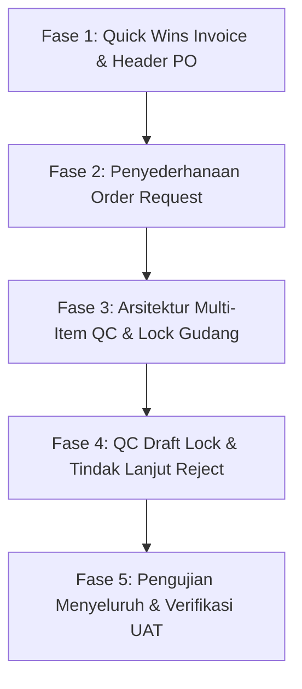

# Rencana Implementasi & Hasil Audit: 7 Poin Feedback Customer Duta Tunggal ERP

Dokumen ini menyajikan hasil audit teknis mendalam terhadap kode sumber (*source code*) **Duta Tunggal ERP** berdasarkan 7 poin feedback customer, serta menyusun peta jalan (*roadmap*) tahapan perbaikan secara sistematis dan terukur tanpa mengubah kode sebelum persetujuan.

---

## 1. Ringkasan Eksekutif & Hasil Audit Kode Eksisting

| No | Poin Feedback | Status Audit Kode Saat Ini | Akar Masalah di Kode (*Root Cause*) | Solusi Arsitektur yang Direncanakan |
|---|---|---|---|---|
| **1** | **1 QC untuk Banyak Item** *(Prioritas Tertinggi)* | ⚠️ **Belum Mendukung Multi-Item** | Tabel `quality_controls` didesain 1 baris per produk (`product_id`, `from_model_id` = `PurchaseOrderItem`). Fungsi `createPurchaseReceiptFromQc()` di `QualityControlService.php` menerbitkan 1 `PurchaseReceipt` (GRN) untuk setiap baris QC. PO 30 item menghasilkan 30 nomor QC dan 30 nomor GRN. | Mengubah alur QC menjadi Header-Detail (`QualityControl` sebagai header dokumen penerimaan, dan `QualityControlItem` sebagai baris item). Satu kedatangan barang memilih PO -> mengisi kuantitas diterima/lolos/reject per baris -> menghasilkan **1 Nomor QC** dan **1 Nomor GRN** untuk seluruh item. |
| **2** | **QC Draft Mengunci Qty & Auto-Batal** | ⚠️ **Validasi Terlambat di 'Complete'** | Validasi ketersediaan kuantitas saat ini baru melempar Exception di `QualityControlService::createPurchaseReceiptFromQc()` saat klik "Complete". Jika ada draft QC menggantung atau PO ditutup, proses gagal tanpa pesan ramah. | Validasi kuantitas dipindahkan ke saat **Simpan Draft** (`save`/`mutateFormDataBeforeCreate`). Sisa kuantitas dihitung: `Qty PO - Qty Diterima (GRN) - Qty Terkunci Draft QC Lain`. Menampilkan pesan jelas: *"Sisa yang bisa di-QC 10 pcs (20 pcs sedang di QC-P-xxx)"*. Event listener pada penutupan PO otomatis membatalkan seluruh draft QC terkait. |
| **3** | **Invoice Merefer PO + Penerimaan, Bukan OR** | ❌ **Terkunci Keras di Kode** | Di `CreatePurchaseInvoice.php` baris 24-28 terdapat validasi keras: `if (!empty($selected_purchase_orders) && empty($selected_order_request)) { throw ValidationException ... }`. Hal ini menyebabkan PO Direct (tanpa OR) mustahil dibuatkan invoice tagihannya. | Menghapus validasi wajib `selected_order_request`. Alur invoice menjadi: Supplier -> Pilih PO (bisa jamak) -> Pilih Penerimaan Barang (GRN) yang belum ditagih. OR hanya berfungsi sebagai filter/info opsional. Nomor invoice supplier & nomor faktur pajak yang sudah dibuat tetap divalidasi keunikannya per supplier. |
| **4** | **PO Pakai Gudang, Beban ke Pusat** | ⚠️ **Gudang Opsional, Cabang Tersebar** | Di `PurchaseOrderResource.php`, `warehouse_id` masih berlabel `(Opsional)`, dan item `OrderRequestItem` masih membawa `cabang_id` per baris. Belum ada penguncian cabang akuntansi ke *Pusat*. | Menjadikan `warehouse_id` pada header PO wajib diisi (1 PO = 1 gudang tujuan). Cabang akuntansi PO otomatis dikunci ke *Pusat* (Cabang ID 1). Kolom cabang per baris item dihilangkan. Pengiriman antar cabang diarahkan menggunakan modul *Stock Transfer*. |
| **5** | **Hanya Gudang di PO yang Boleh QC** | ⚠️ **Bisa Memilih Gudang Bebas** | Field `warehouse_id` di form QC masih bisa diubah jika PO tidak menetapkan gudang, dan belum ada filter otorisasi berdasarkan `Auth::user()->warehouse_id`. | Mengunci field `warehouse_id` di form QC secara mutlak mengikuti `PO->warehouse_id`. Menambahkan pembatasan otorisasi: user pemeriksa gudang hanya dapat memproses QC untuk PO yang ditujukan ke gudang tugasnya (`user->warehouse_id`), kecuali Super Admin/Owner. |
| **6** | **OR Disederhanakan** | ⚠️ **Terlalu Kompleks untuk Pemohon** | Di `OrderRequestResource.php`, item OR mewajibkan `cabang_id`, `currency_id`, serta memuat kolom harga master, harga satuan, diskon, pajak, dan subtotal yang membingungkan staf divisi peminta barang. | Menyederhanakan formulir OR: pemohon hanya mengisi Nama Barang, Qty, Tanggal Dibutuhkan (`required_date`), Peminta/Keperluan (`purpose`), dan Catatan. Kolom harga, mata uang, pajak, diskon, dan supplier disembunyikan/dikosongkan untuk diisi oleh tim Purchasing saat membuat PO. |
| **7** | **Tindak Lanjut Barang Reject** | ⚠️ **Sudah Ada Dasar, Perlu Integrasi Multi-Item** | Logika aksi reject (`wait_next_delivery`, `return_supplier`, `reduce_stock`) telah diimplementasikan pada audit sebelumnya di tingkat single-item. Perlu disatukan ke form multi-item QC. | Menyatukan pemilih aksi tindak lanjut reject ke dalam tabel multi-item QC. Jika ada baris dengan `rejected_quantity > 0`, sistem mengeksekusi tindak lanjut secara otomatis sesuai pilihan (tunggu kiriman baru, buat draf retur supplier, atau kurangi qty PO). |

---

## 2. Rincian Audit Teknis Mendalam per Poin

### Poin 1: 1 QC untuk Banyak Item (Prioritas Tertinggi)
- **Kondisi Kode Saat Ini**:
  - `QualityControl` di `app/Models/QualityControl.php` bertindak sekaligus sebagai header dan item (`product_id`, `quantity_received`, `passed_quantity`, `rejected_quantity`).
  - Method `createPurchaseReceiptFromQc()` di `QualityControlService.php` (baris 1034-1057) membuat record `PurchaseReceipt` baru untuk setiap kali sebuah baris QC diproses.
  - Akibatnya: Jika PO memiliki 30 item barang, staf gudang harus membuka form QC 30 kali, menghasilkan 30 nomor QC berbeda, dan menerbitkan 30 nomor GRN yang terpecah-pecah.
- **Rencana Arsitektur Baru**:
  - Membuat tabel relasi `quality_control_items` (`quality_control_id`, `purchase_order_item_id`, `product_id`, `quantity_received`, `passed_quantity`, `rejected_quantity`, `failed_qc_action`, `notes`, `status`).
  - Model `QualityControl` menjadi header dokumen QC yang mereferensikan `purchase_order_id`, `qc_number`, `inspected_by`, `warehouse_id`, `cabang_id`, `status`.
  - Pada form pembuatan QC: Pengguna memilih PO -> Sistem secara reaktif memuat tabel repeater seluruh item PO yang masih memiliki sisa kuantitas belum di-QC -> Pengguna mengisi kuantitas diterima, lolos, dan reject per baris -> Klik Simpan.
  - Saat diproses, sistem hanya membuat **1 nomor QC** dan **1 nomor GRN** (`PurchaseReceipt`) dengan banyak baris `PurchaseReceiptItem`, sehingga pencatatan mutasi stok dan penjurnalan akuntansi menjadi 1 kesatuan utuh.

---

### Poin 2: QC Draft Harus Mengunci Qty & Auto-Batal Jika PO Ditutup
- **Kondisi Kode Saat Ini**:
  - `QualityControlPurchaseResource.php` sudah memiliki method kalkulasi `draftQcPendingQuantity()`, namun validasi keras baru terjadi saat eksekusi `createPurchaseReceiptFromQc()` di `QualityControlService.php` yang melempar `Exception` generic jika kuantitas melebihi sisa PO.
  - Draft QC yang masih terbuka tidak dibatalkan ketika PO di-close manual atau completed dari penerimaan lain, sehingga saat draft tersebut dibuka kembali terjadi eror "proses QC gagal".
- **Rencana Arsitektur Baru**:
  - Validasi dilakukan di tingkat form save (`rules` dan `mutateFormDataBeforeCreate`):
    $$\text{Sisa Qty Tersedia} = \text{Qty Pesanan PO} - \text{Qty Diterima Sebelumnya} - \sum \text{Qty di Draft QC Lain}$$
  - Menampilkan pesan validasi ramah: *"Sisa yang bisa di-QC untuk item [Nama Produk] adalah 10 pcs (20 pcs sedang dikunci pada draft QC-YYYYMMDD-XXXX)"*.
  - Menambahkan Observer pada model `PurchaseOrder`: ketika status PO berubah menjadi `completed` atau `closed`, sistem otomatis mengupdate seluruh `quality_controls` berstatus draft (`status = 0`) yang mereferensikan PO tersebut menjadi dibatalkan/dihapus (*soft delete* atau status `cancelled`).

---

### Poin 3: Invoice Merefer PO + Penerimaan, Bukan OR
- **Kondisi Kode Saat Ini**:
  - File `app/Filament/Resources/PurchaseInvoiceResource/Pages/CreatePurchaseInvoice.php` baris 24-28 memiliki blok kode:
    ```php
    if (!empty($data['selected_purchase_orders']) && empty($data['selected_order_request'])) {
        throw ValidationException::withMessages([
            'selected_order_request' => 'Order Request harus dipilih terlebih dahulu sebelum memilih Purchase Order.',
        ]);
    }
    ```
  - Hal ini memblokir seluruh pembuatan invoice untuk PO yang dibuat langsung (Direct PO).
- **Rencana Arsitektur Baru**:
  - Hapus blok validasi tersebut dari `CreatePurchaseInvoice.php`.
  - Pada form `PurchaseInvoiceResource.php`, ubah field `selected_order_request` murni sebagai filter pencarian opsional.
  - Alur utama pembuatan invoice:
    1. Pilih **Supplier**.
    2. Pilih **Purchase Order** (mendukung pemilihan multiple PO dari supplier yang sama).
    3. Pilih **Penerimaan Barang (GRN)** yang belum difakturkan.
    4. Masukkan **No. Invoice Supplier** dan **No. Faktur Pajak** (validasi pencegahan duplikasi per supplier tetap aktif).

---

### Poin 4: PO Pakai Gudang, Beban ke Pusat
- **Kondisi Kode Saat Ini**:
  - Header PO memiliki field `warehouse_id` namun masih berstatus opsional (`nullable()`).
  - Header PO memiliki field `cabang_id` yang bisa dipilih ke cabang manapun.
  - Item PO / OR membawa `cabang_id` per baris.
- **Rencana Arsitektur Baru**:
  - **Kepala PO**: Field `warehouse_id` diubah menjadi `required()` (1 PO = 1 Gudang Penerimaan Utama).
  - **Cabang Akuntansi PO**: Dikunci otomatis ke *Cabang Pusat* (`cabang_id = 1` / `Cabang Pusat Jakarta`). Field dibuat *read-only*.
  - **Item PO**: Kolom `cabang_id` per baris item dihilangkan dari tampilan dan form.
  - **SOP Distribusi ke Cabang**: Jika barang yang dibeli diperuntukkan bagi cabang di luar Pusat, alur operasionalnya adalah: Barang diterima di Gudang Pusat, kemudian dikirim ke cabang tujuan menggunakan modul **Stock Transfer**.
  - ⚠️ *Poin Konfirmasi Akuntan*: Skema penjurnalan akuntansi antar cabang (Rekening Koran Antar Kantor / RAK) saat Stock Transfer dieksekusi perlu dikonfirmasi kepada pihak akuntan customer.

---

### Poin 5: Hanya Gudang di PO yang Boleh QC
- **Kondisi Kode Saat Ini**:
  - Di form QC, dropdown `warehouse_id` masih aktif jika PO belum menetapkan gudang tujuan.
  - Pengguna dengan hak akses QC dapat memilih gudang mana pun di cabang tersebut.
- **Rencana Arsitektur Baru**:
  - Pada form QC, field `warehouse_id` otomatis terisi dari `PO->warehouse_id` dan dikunci mati (*read-only / disabled*).
  - Di backend, penerimaan barang (`PurchaseReceiptItem`) dan mutasi stok (`StockMovement`) 100% dialokasikan ke gudang yang tertera pada PO.
  - Memeriksa penugasan gudang user: Model `User` sudah memiliki kolom `warehouse_id`. Jika `Auth::user()->warehouse_id` terisi (misal petugas Gudang A), sistem menyaring PO yang bisa di-QC hanya PO yang `warehouse_id == Auth::user()->warehouse_id`. Jika pengguna mencoba memproses PO untuk Gudang B, sistem menolak dengan pesan otorisasi. Super Admin dan Owner memiliki akses menyeluruh.

---

### Poin 6: OR Disederhanakan
- **Kondisi Kode Saat Ini**:
  - Form `OrderRequestItem` saat ini mewajibkan `cabang_id`, `currency_id`, dan menampilkan field harga satuan, diskon, pajak, subtotal, dan supplier.
  - Pemohon barang (staf operasional/lapangan) kesulitan mengisi field-field finansial tersebut karena belum mengetahui supplier dan harga riil.
- **Rencana Arsitektur Baru**:
  - Menambahkan kolom pada tabel `order_requests`:
    - `required_date` (`tanggal_dibutuhkan`) — tanggal barang diharapkan tiba.
    - `purpose` (`keperluan` / `peminta`) — tujuan penggunaan barang.
  - Menyederhanakan form item OR:
    - Hanya mewajibkan: **Produk (`product_id`)**, **Jumlah (`quantity`)**, dan **Catatan (`note`)**.
    - Menghilangkan kewajiban cabang per item (default mengikuti cabang pembuat atau Pusat).
    - Menyembunyikan/menonaktifkan input harga, mata uang, pajak, diskon, dan supplier pada form pemohon OR biasa.
  - Pada saat persetujuan OR menjadi PO oleh bagian Purchasing:
    - Purchasing memilih Supplier, menetapkan Harga Satuan, Mata Uang, Pajak, dan Gudang Tujuan PO.

---

### Poin 7: Tindak Lanjut Barang Reject
- **Kondisi Kode Saat Ini**:
  - Logika 3 aksi reject (`wait_next_delivery`, `return_supplier`, `reduce_stock`) telah selesai diuji pada modul single-item QC.
- **Rencana Arsitektur Baru**:
  - Mengintegrasikan pemilih aksi reject tersebut ke dalam antarmuka Multi-Item QC (Poin 1):
    - Jika kolom `rejected_quantity > 0` pada baris item, pengguna wajib memilih salah satu opsi:
      1. **Tunggu Penggantian (`wait_next_delivery`)**: Sisa pesanan PO tetap terbuka, menunggu pengiriman barang pengganti di GRN berikutnya.
      2. **Retur ke Supplier (`return_supplier`)**: Otomatis membuat draf Dokumen Retur Pembelian (*Purchase Return*) dengan nomor referensi penerimaan terkait.
      3. **Batalkan Sisa PO (`reduce_stock`)**: Memotong kuantitas pesanan pada item PO sebesar kuantitas reject, sehingga status PO dapat diselesaikan (*completed*) tanpa menggantung.

---

## 3. Roadmap & Tahapan Rencana Aksi (Phased Implementation Plan)

Pekerjaan perbaikan akan dibagi ke dalam 5 fase bertahap dengan prinsip pengujian otomatis (*automated testing*) di setiap akhir fase:



### 🔹 Fase 1: Quick Wins — Invoice Tanpa OR & Standardisasi Header PO
*Estimasi Risiko: Rendah (Mengatasi keluhan langsung agar PO Direct dapat ditagih)*
1. **Purchase Invoice**:
   - Menghapus blok pengecekan wajib `selected_order_request` pada `CreatePurchaseInvoice.php`.
   - Menguji pembuatan invoice untuk Direct PO dan memastikan relasi 3-way matching tetap utuh.
2. **Purchase Order Header**:
   - Mengubah `warehouse_id` pada form PO menjadi `required()`.
   - Mengunci `cabang_id` akuntansi PO secara otomatis ke *Pusat*.
   - Menyembunyikan pilihan cabang per baris item di PO.

### 🔹 Fase 2: Penyederhanaan Modul Order Request (OR)
*Estimasi Risiko: Rendah-Sedang*
1. **Migrasi Basis Data**:
   - Menambahkan kolom `required_date` (date) dan `purpose` (varchar 255) pada tabel `order_requests`.
2. **Formulir Input OR**:
   - Memperbarui `OrderRequestResource.php`: menampilkan Tanggal Dibutuhkan & Keperluan di form header.
   - Mengubah skema repeater item: hanya menampilkan Nama Produk, Kuantitas, Satuan, dan Catatan.
   - Menghapus validasi wajib untuk harga, mata uang, pajak, diskon, dan cabang per item.
3. **Konversi OR ke PO di Purchasing**:
   - Memastikan form modal konversi OR ke PO di `ViewOrderRequest.php` dan service `OrderRequestService.php` menangani item tanpa harga dengan mengambil harga standar supplier atau meminta input harga dari staf purchasing.

### 🔹 Fase 3: Arsitektur Ulang QC Multi-Item & Penguncian Gudang (Prioritas Tertinggi)
*Estimasi Risiko: Sedang-Tinggi (Perubahan Struktur QC)*
1. **Migrasi Basis Data**:
   - Membuat tabel `quality_control_items` untuk mendukung relasi 1 Header QC -> Banyak Item QC.
   - Menambahkan kolom `purchase_order_id` pada tabel `quality_controls` jika belum ada.
2. **Model & Service**:
   - Menambahkan relasi `items()` pada model `QualityControl`.
   - Menulis ulang `QualityControlService::createPurchaseReceiptFromQc()` agar menerbitkan **1 nomor GRN** untuk 1 dokumen QC yang berisi seluruh item lolos inspeksi.
3. **Antarmuka Form QC**:
   - Memperbarui `QualityControlPurchaseResource.php`: Pengguna memilih PO -> form memunculkan tabel daftar item PO yang tersisa -> pengguna mengisi Qty Diterima, Lolos, dan Reject per baris.
   - Mengunci field `warehouse_id` pada form QC sesuai `PO->warehouse_id`.
   - Menambahkan filter hak akses: membatasi daftar PO yang dapat di-QC berdasarkan `Auth::user()->warehouse_id`.

### 🔹 Fase 4: Penguncian Kuantitas QC Draft & Tindak Lanjut Reject
*Estimasi Risiko: Sedang*
1. **Penguncian Kuantitas Saat Simpan Draft**:
   - Menambahkan validasi saat simpan (create/update draft QC): menghitung sisa PO dikurangi kuantitas di draft QC lain yang sedang aktif.
   - Menampilkan pesan error validasi yang spesifik menyebutkan nomor draft yang sedang mengunci kuantitas.
2. **Auto-Batal Draft QC saat PO Ditutup**:
   - Mendaftarkan event listener pada observer `PurchaseOrder`: saat status PO berubah menjadi `completed` atau `closed`, otomatis membatalkan/menghapus draft QC yang belum selesai.
3. **Integrasi Tindak Lanjut Reject**:
   - Memasang pilihan aksi tindak lanjut (`wait_next_delivery`, `return_supplier`, `reduce_stock`) pada tabel multi-item QC saat kuantitas reject > 0.

### 🔹 Fase 5: Pengujian Otomatis & Verifikasi Menyeluruh
*Estimasi Risiko: Sangat Rendah*
1. **Pembuatan Automated Feature Test**:
   - Mengembangkan test suite baru `tests/Feature/CustomerFeedbackAuditVerificationTest.php` untuk memvalidasi ke-7 poin di atas secara otomatis.
2. **Uji Regresi**:
   - Menjalankan kembali seluruh test suite yang ada (`InternalControlAuditVerificationTest`, `QualityControlInspectorDefaultTest`, `OrderRequestToPurchaseOrderTest`, `PurchaseInvoiceTest`) untuk memastikan stabilitas sistem 100%.

---

## 4. Hal yang Memerlukan Konfirmasi Pengguna / Akuntan

> [!IMPORTANT]
> **1. Skema Akuntansi Cabang Pusat & Stock Transfer (Poin 4)**:
> Saat PO dibebankan ke Pusat dan barang diterima di Gudang Pusat, lalu kemudian dikirim ke cabang operasional melalui *Stock Transfer*, sistem akan membentuk jurnal mutasi persediaan antar cabang. Perlu konfirmasi apakah akuntan customer menghendaki akun perantara **Rekening Antar Kantor (RAK / Inter-Branch Receivable & Payable)** atau mutasi persediaan langsung.

> [!NOTE]
> **2. Akses Gudang Pengguna (Poin 5)**:
> Untuk pembatasan akses QC per gudang, sistem akan menggunakan kolom `warehouse_id` yang sudah ada di tabel `users`. Jika seorang user tidak memiliki `warehouse_id` khusus (misal Admin Pusat), apakah user tersebut diizinkan melakukan QC ke seluruh gudang atau wajib ditentukan minimal 1 gudang default?

---

Dokumen ini disusun sebagai panduan audit dan tahapan perbaikan resmi. Belum ada perubahan kode (*source code update*) yang dilakukan sampai Anda menyetujui tahapan rencana di atas.
